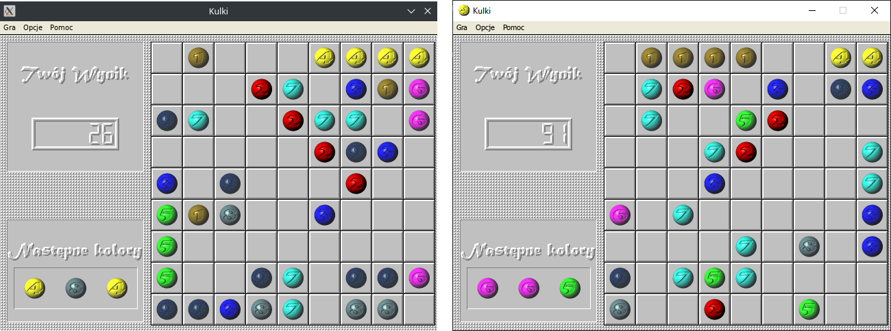

# Kulki
Remake kultowej gry Kulki stworzonej przez Jarosława Lewandowskiego. Gra została odwzorowana od podstaw, z zamiarem uruchamiania na nowoczesnych systemach.



## Windows
Gotowy program do uruchomienia w 64-bitowym systemie Windows jest dostępny do pobrania w zakładce "Releases".

## Linux
### Kompilacja
Wymagana jest instalacja bibliotek `SDL2`, `SDL2_image` i `SDL_ttf` w wersji `devel`.
W folderze projektu przy pomocy terminala:
```
mkdir build && cd build
cmake -DCMAKE_BUILD_TYPE=Release ..
make
```

### Uruchomienie
W folderze `build`:
```
./Kulki
```